I built an OpenCode-based agent to find out! Check out the code in the [GitHub repo](https://github.com/meffmadd/baba_is_agent)!

[Baba is You](https://www.hempuli.com/baba/) is a puzzle game where the player has to navigate grid-based levels and manipulate textual rules to get to an eventual win state. The rules affect entities on the grid such as walls, flags, rocks or yourself.

## Harness

OpenCode is an open-source CLI coding-agent that is extensible, including writing your own tools the agent can use. I was inspired by the fantastic [baba_is_eval](https://github.com/lennart-finke/baba_is_eval) repo and adapted its existing code, which was an MCP server, to work with OpenCode. On top of updating the tools handling the core gameplay from the existing repo, I added `game_insights` and `shortest_path` as utility tools. Here is the list of tools the agent had access to:

- **get_game_state** - Get current game state either as a 2D array of strings (`grid`) or a JSON list of entities (`entities`)
- **execute_game_commands** - Execute a list of movement commands (up, down, left, right, idle)
- **restart_level** - Restart the current level
- **game_insights** - Shows the active rules, you/win positions, and the shortest path to a win position (if applicable)
- **shortest_path** - A* pathfinding to target position, avoiding blocked entities (e.g. entities with stop or defeat rules)
- **undo_multiple** - Undo last N moves
- **todowrite** - Track task progress (OpenCode native)

The two formats of the `get_game_state` tool are inspired by ARC AGI 3 [@arcagi3] and a paper by Nicolas Martorell [@martorell2025]. ARC AGI 3 returns the game state as a [3D array](https://docs.arcprize.org/api-reference/commands/start-or-reset-game-instance#response-frame) (one extra temporal dimension), which corresponds to the `grid` format here. The `entities` format is based on the Cartesian JSON notation from the paper [@martorell2025], which performed very well in their evaluation.

## Evaluation

The timeout for each evaluation run was set to 20 minutes with a 200,000 token threshold. Models never reached the 200,000 token threshold and only ever timed-out.

**Caveats**:

- Evaluations were run only once per level and model (time/money constraints)
- I forgot to remove the `AGENTS.md` file for evaluation (context bloat for level solve)
- Stats entierly rely on information provided by the OpenCode JSON logs

OpenCode Go/Zen was used as a model provider. 

## Results

The following table shows the overall results of the models. We see some variance in model cabability across open and closed frontier models. `Gemini 3.1 Pro` was able to solve all levels while the best open-weights model is `GLM 5.1` with 5 out of 8 levels beaten.

| Model | Passed | Level 0 | Level 1 | Level 2 | Level 3 | Level 4 | Level 5 | Level 6 | Level 7 |
|---|---|---|---|---|---|---|---|---|---|
| MiniMax M2.7 | 1/8 | ✅ | ❌ | ❌ | ❌ | ❌ | ❌ | ❌ | ❌ |
| DeepSeek V4 Pro | 3/8 | ✅ | ✅ | ✅ | ❌ | ❌ | ❌ | ❌ | ❌ |
| Kimi K2.6 | 3/8 | ✅ | ✅ | ✅ | ❌ | ❌ | ❌ | ❌ | ❌ |
| Qwen 3.6 Plus | 3/8 | ✅ | ✅ | ✅ | ❌ | ❌ | ❌ | ❌ | ❌ |
| GLM 5.1 | 4/8 | ✅ | ✅ | ✅ | ❌ | ✅ | ❌ | ❌ | ❌ |
| Claude Opus 4.7 | 5/8 | ✅ | ✅ | ✅ | ✅ | ❌ | ❌ | ✅ | ❌ |
| GPT 5.5 | 7/8 | ✅ | ✅ | ✅ | ✅ | ✅ | ✅ | ✅ | ❌ |
| Gemini 3.1 Pro | 8/8 | ✅ | ✅ | ✅ | ✅ | ✅ | ✅ | ✅ | ✅ |

In the followning sections I want to quickly go over the results for each level in a bit more detail. The models different quite a bit in both the time to solve the level and the token/tool calls required to do so. However, it is not possible to draw any definitive conclusion with only a single attempt per level per model.

### Level 0

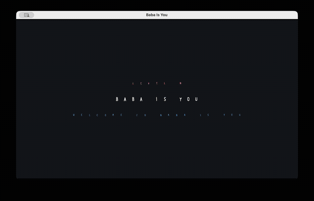{width=65%}

Level 0 is the introductory level and is trivial as a result. The solution is just moving right 8 times, since the rocks can be pushed.

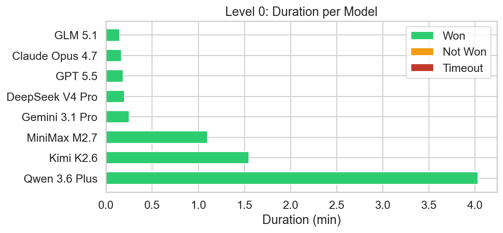{width=80%}

Due to the level's simplicity all models were able to solve it. `Qwen 3.6 Plus` is a bit of an outlier here in terms of the time required to solve the level. It also made 8 tool calls, whereas all other models required only 2-3.

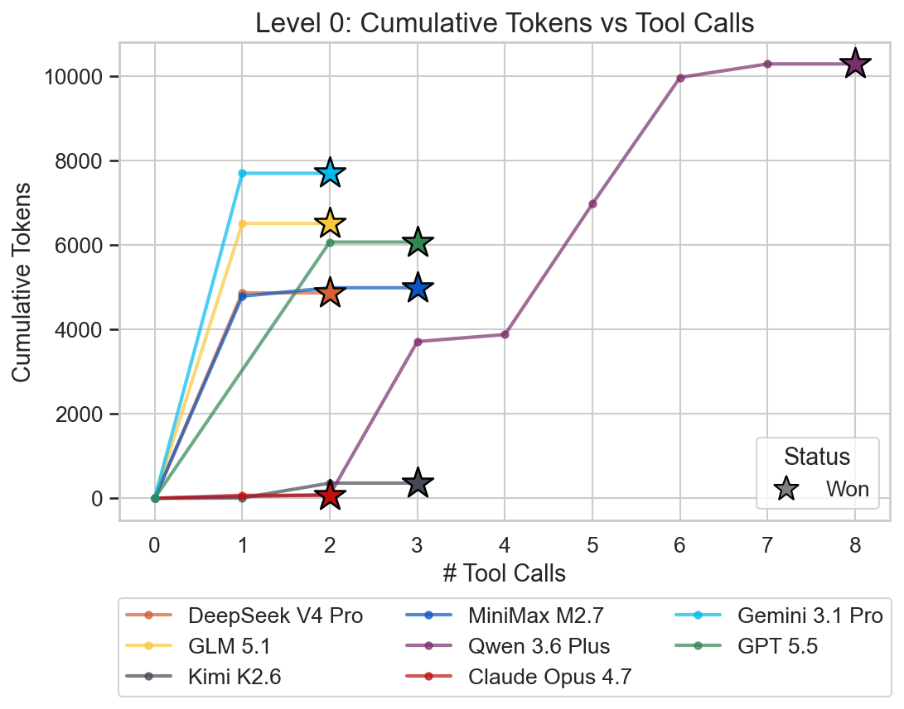{width=80%}

### Level 1

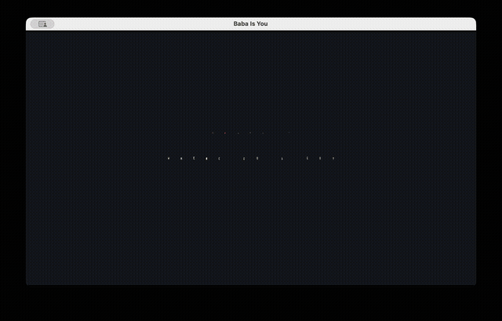{width=65%}

For this level there are two straightforward options to solve the level. Either construct `FLAG IS WIN` or the slightly more tricky solution is to construct `WALL IS WIN`.

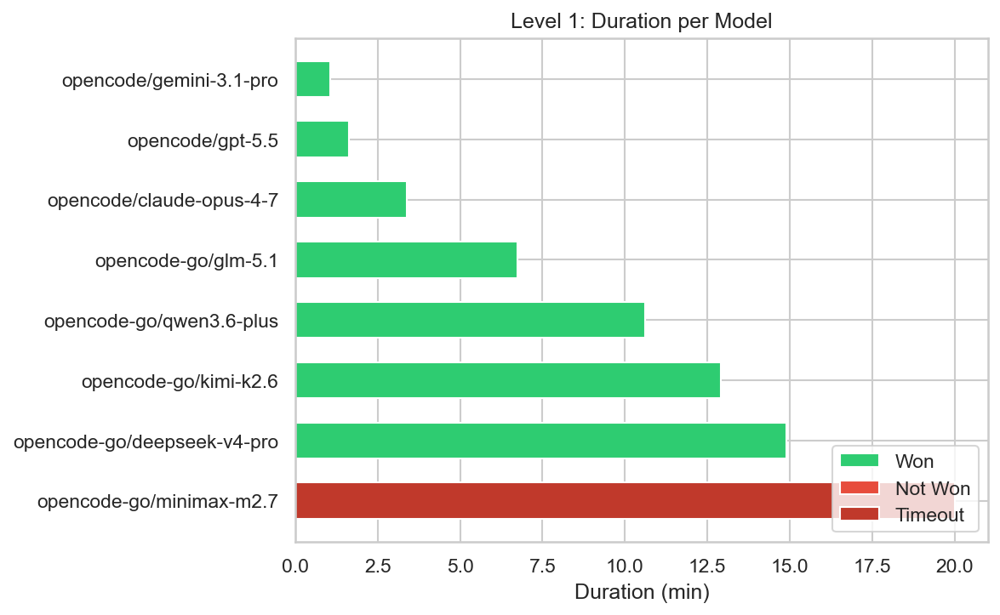{width=80%}

This level was a bit of foreshadowing of the overall results. `Gemini 3.1 Pro` was clearly the fastest followed by the closed frontier models. `Minimax M2.7` already timed-out and the other open models needed significantly more time compared to the closed frontier models.

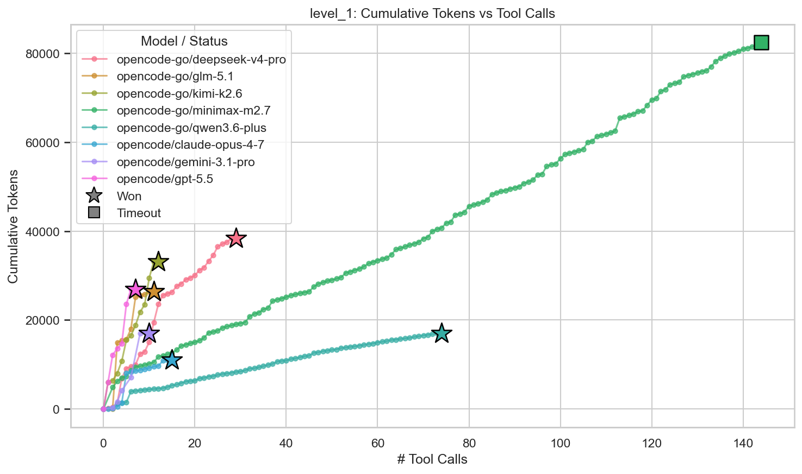{width=80%}

### Level 2

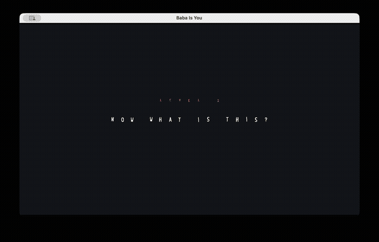{width=65%}

Level 2 is conceptually very similar to level 1 with the same layout, however the entities are now permuted (e.g. `FLAG` now acts as a wall). There is now only one option to solve the level, namely to construct `FLAG IS WIN`. This corresponds to the second option from level 1.

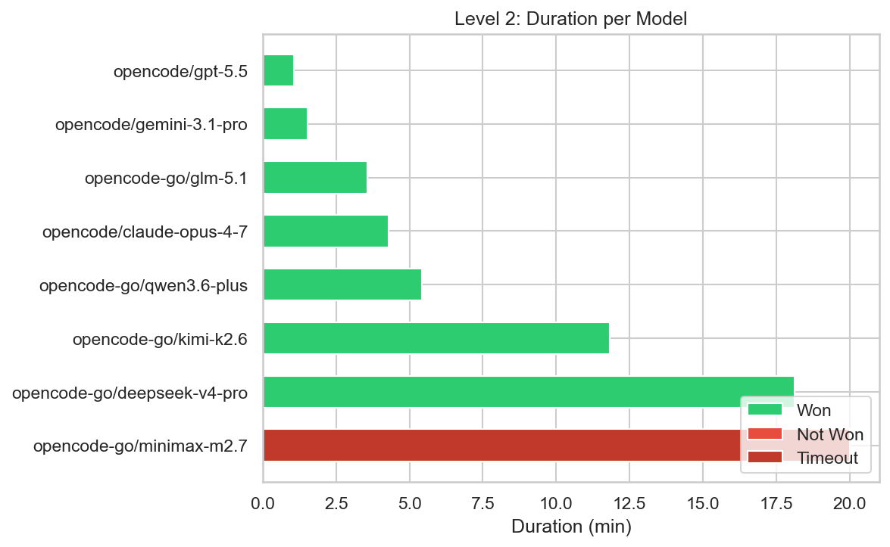{width=80%}

Models needed a bit more time to solve this level so the difficulty seems to indeed be a bit higher compared to level 1.

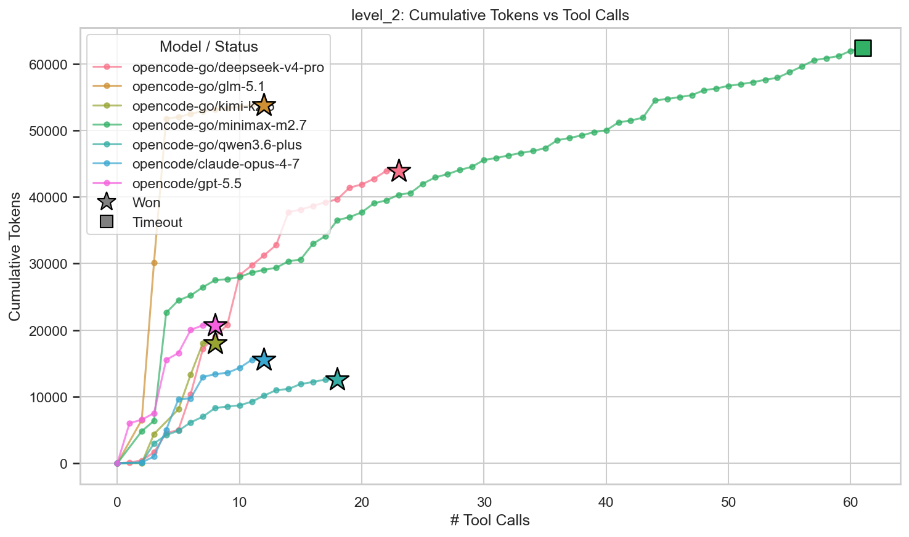{width=80%}

### Level 3

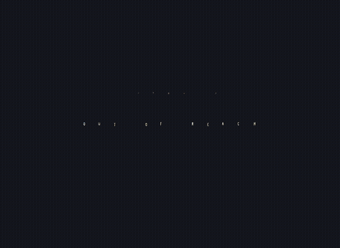{width=65%}

In this level, the `FLAG` is a red herring and the flag and rock rules in the lower right corner have to be manipulated to form `ROCK IS WIN`. This is also a level where the sink mechanic is used. The first rock has to be pushed against a water block to destroy it and be able to pass.

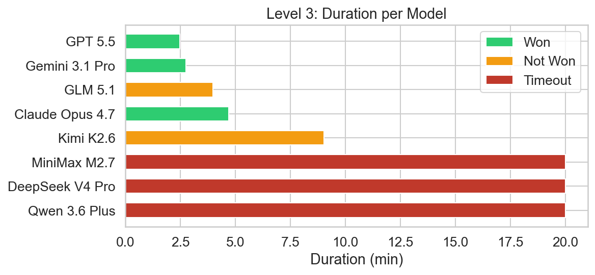{width=80%}

Here we see a new case where a solve failed for the first time without timing out. `GLM 5.1` and `Kimi K2.6` produced more than 32k reasoning tokens, which prematurely exits the evaluation. `DeepSeek V4 Pro` and `Qwen 3.6 Plus` reached the time limit and timed out. This means only the closed frontier models were able to solve this level.

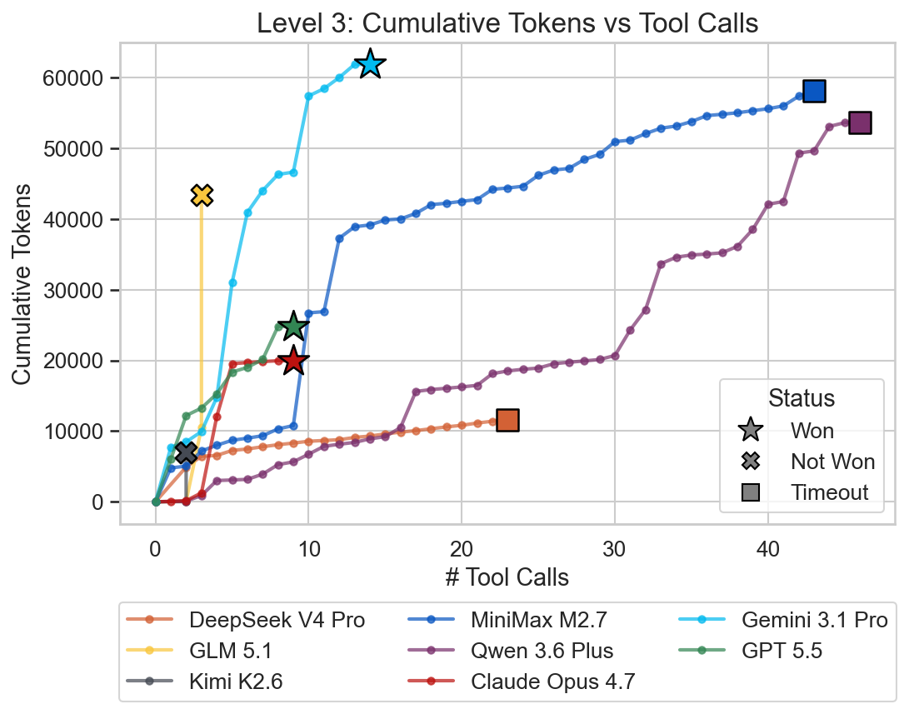{width=80%}

### Level 4

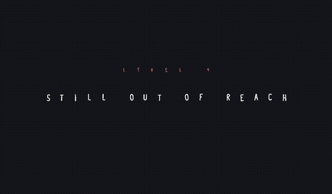{width=65%}

In this level, we encounter the `DEFEAT` rule for the first time. It has to be deactivated to bypass the skull barrier surrounding the flag with the win condition. This can be done by using the rocks or the text of the `ROCK IS PUSH` rule itself to break the `SKULL IS DEFEAT` rule.

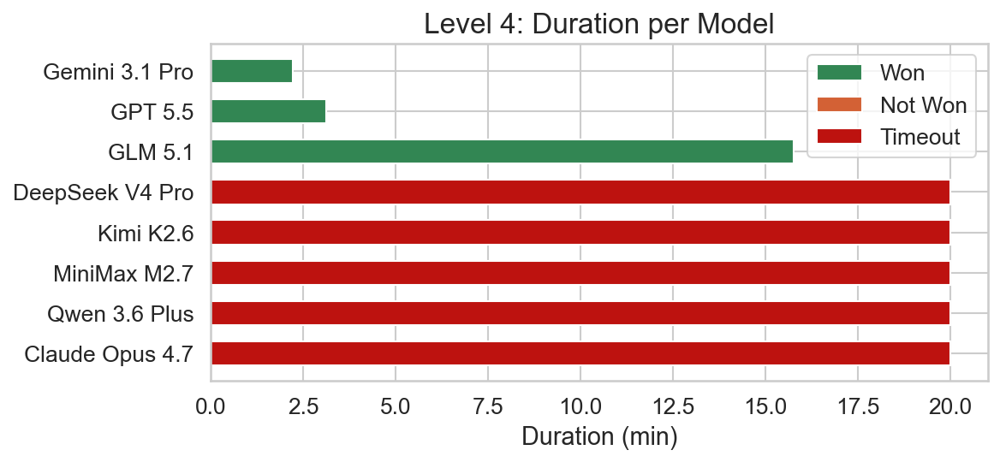{width=80%}

`GLM 5.1` was able to solve this level while `Opus 4.7` reached the time limit. `Gemini 3.1 Pro` and `GPT 5.5` were able to solve the level very quickly and efficiently again.

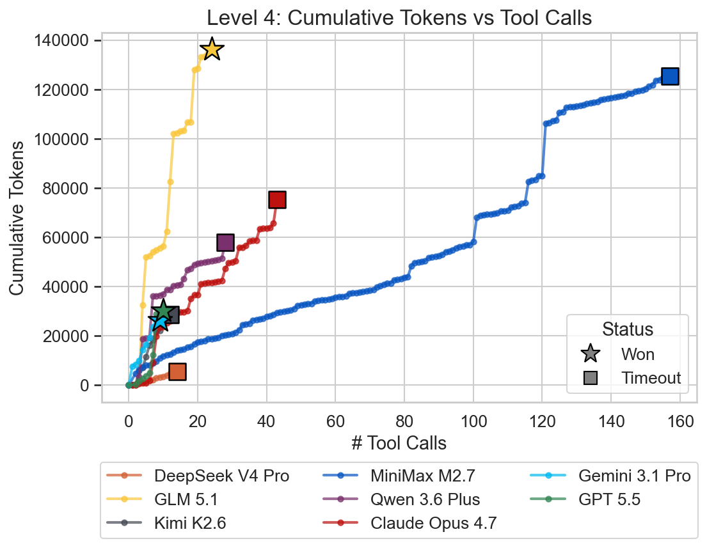{width=80%}

### Level 5

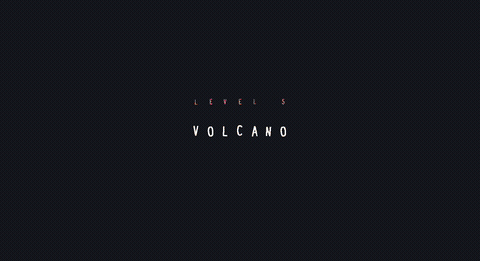{width=65%}

Level 5 requires creative rule manipulation to make the `LAVA` pushable, thus bypassing the `HOT` and `MELT` constraints.

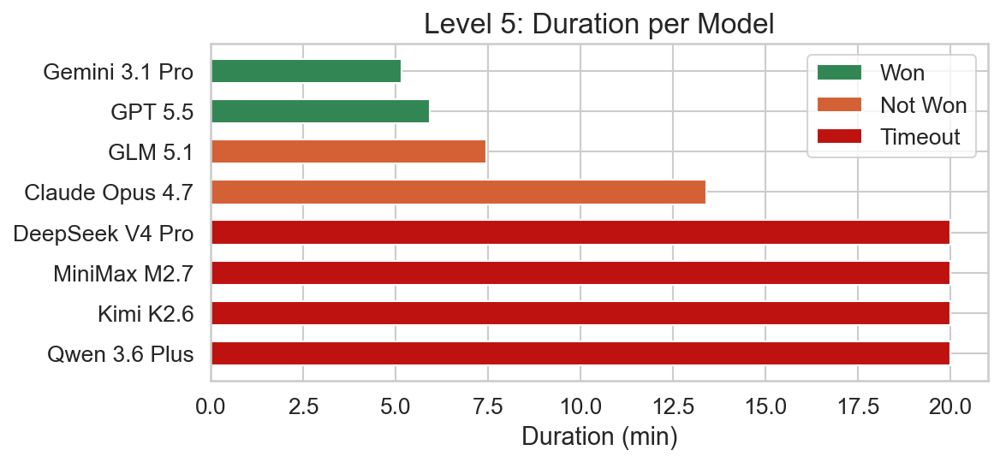{width=80%}

The challenge for `Gemini 3.1 Pro` and `GPT 5.5` was definitely turned up a notch as the solving times almost doubled for this level compared to the previous one. `GLM 5.1` and `Opus 4.7` encountered an error again, exceeding the maximum number of output tokens per step. The remaining models were unable to solve the level within the 20 minutes time frame.

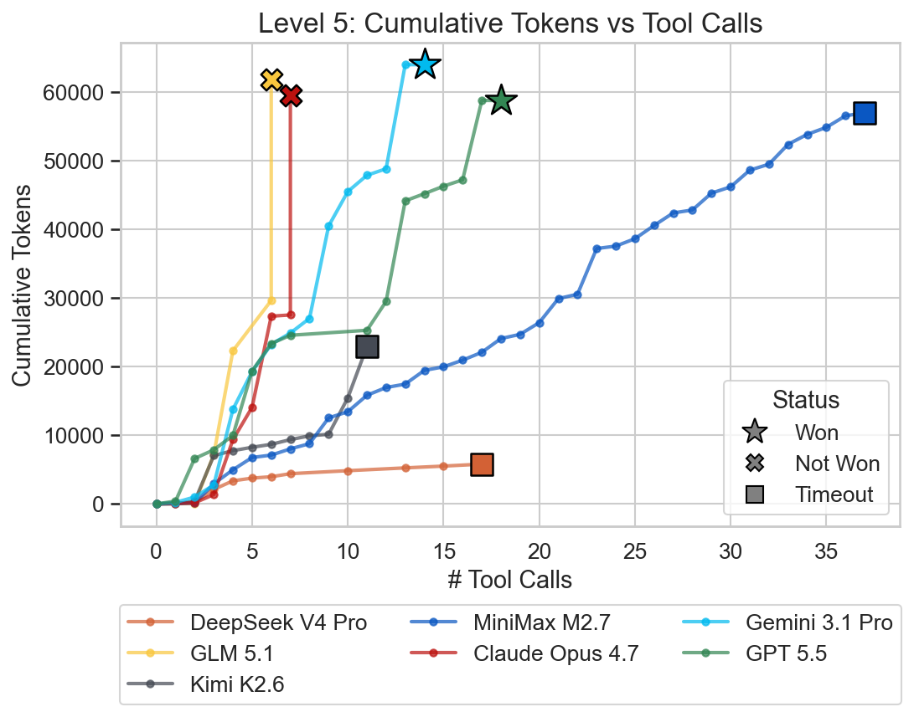{width=80%}

### Level 6

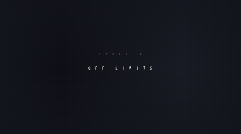{width=65%}

This level again requires creative rule manipulation. Since `SKULL IS DEFEAT` cannot be deactivated, we have to find a way to bypass the skull barrier. To achieve this, we have to create a `WALL IS YOU` rule, since some wall blocks are already past the barrier. This way we can reach the flag and win.

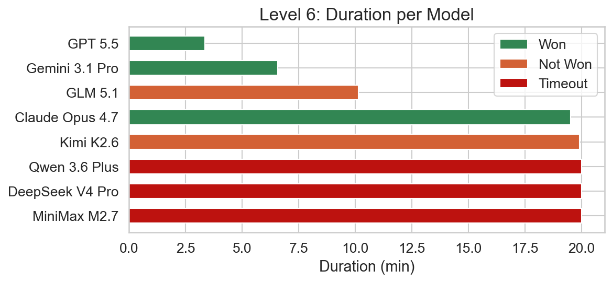{width=80%}

`Opus 4.7` was barely able to solve this level within the 20 minutes. `GPT 5.5` and `Gemini 3.1 Pro` were able to solve the level very quickly again. In this level, `Kimi K2.6` gave up voluntarily after extensive trial and error just before the timeout. `GLM 5.1` hit the output token limit. Only the closed frontier models were able to solve this level. 

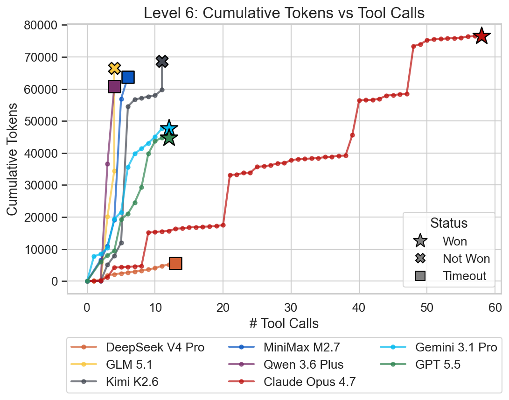{width=80%}

### Level 7

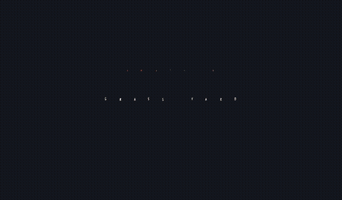{width=65%}

Level 7 is conceptually very simple but has a few gotchas. Firstly, the walls can be ignored completely and only create the illusion that the area is enclosed. In reality they are no obstacle at all. Meanwhile the grass encloses the `FLAG` and `WIN` bocks and creates a sort of labyrinth. The text blocks have to be moved out of the grass labyrinth and then the `BABA IS YOU` rule has to be reused to create the `FLAG IS WIN` rule, sharing the `IS`. The level is also movement heavy, requiring a lot of precise positioning.

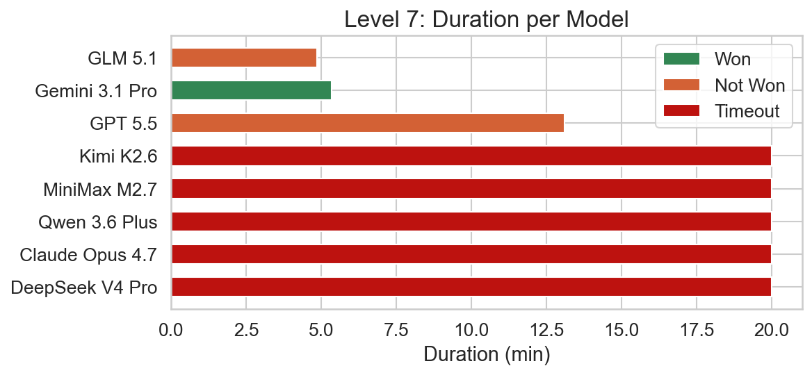{width=80%}

Only `Gemini 3.1 Pro` solved this level successfully. `GPT 5.5` gave up voluntarily in this level, while `GLM 5.1` hit the output limit. All other models ran into the 20 minute timeout.

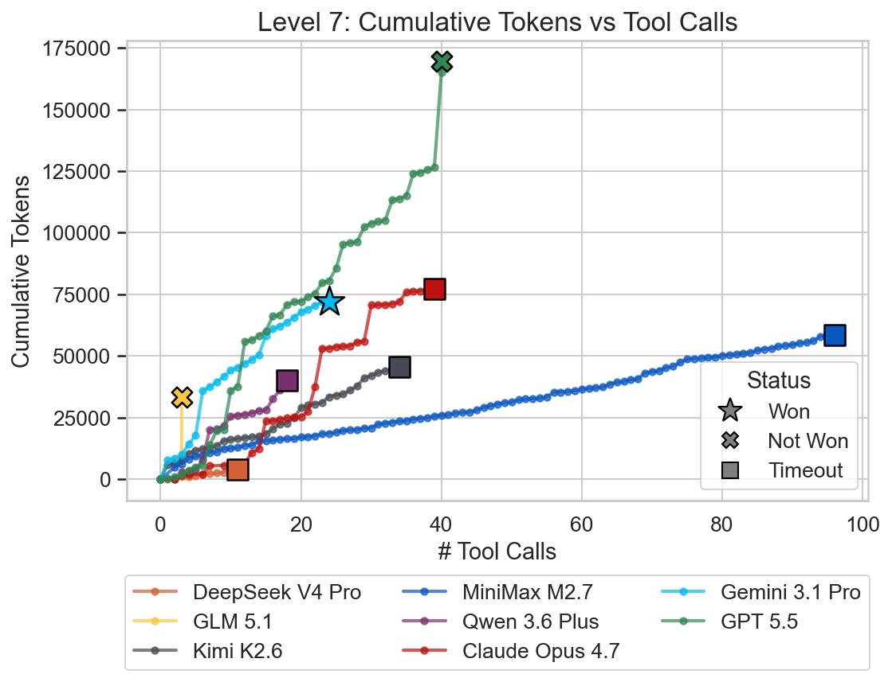{width=80%}

## Wrapping up

After running the evaluations, I was surprised how clear the signal was.
As with some other "boutique" benchmarks, there was a clear distinction between open-weights models and closed frontier models on these more niche tasks.

`Minimax M2.7` was clearly too small and could not solve any non-trivial level. `GLM 5.1` and `Opus 4.7` are quite close and won different levels each. `GLM 5.1` was also the only open weights model to solve a level past level 2. `Gemini 3.1 Pro` and `GPT 5.5` seem to be performing best. They are certainly more efficient. With the release of ARC AGI 3, models will likely improve for this task as well. The closed frontier models tested here barely make a dent in the [ARC AGI 3 leaderboard](https://arcprize.org/leaderboard) and only score 0.1-0.4% as of May 10th 2026.

I now wonder if anything like this shows up in the training data of the closed models or if it is just emergent behavior. Maybe open labs do focus more heavily on pure coding harnesses to close the gap there, while frontier labs train their models in broader contexts. Google seems like like that at least.

## References

::: {#refs}
:::

## Appendix

### Model Cost Matrix

Below is the cost of each model accoss all levels with the overall total.

| Model | Level 0 | Level 1 | Level 2 | Level 3 | Level 4 | Level 5 | Level 6 | Level 7 | Total |
|---|---|---|---|---|---|---|---|---|---|
| MiniMax M2.7 | $0.0021 | $0.2710 | $0.1147 | $0.0846 | $0.3114 | $0.1203 | $0.0535 | $0.1389 | $1.0965 |
| DeepSeek V4 Pro | $0.0088 | $0.2687 | $0.2940 | $0.1526 | $0.1089 | $0.1402 | $0.1457 | $0.1386 | $1.2576 |
| Kimi K2.6 | $0.0009 | $0.0805 | $0.0641 | $0.0439 | $0.1324 | $0.1089 | $0.1294 | $0.1339 | $0.6941 |
| Qwen 3.6 Plus | $0.0416 | $0.1499 | $0.0623 | $0.2797 | $0.2706 | $0.1876 | $0.2082 | $0.1665 | $1.3663 |
| GLM 5.1 | $0.0092 | $0.1616 | $0.2090 | $0.1944 | $0.9351 | $0.2869 | $0.3110 | $0.1507 | $2.2579 |
| Claude Opus 4.7 | $0.0664 | $0.4944 | $0.6071 | $0.7789 | $3.5187 | $1.7768 | $4.1527 | $3.4331 | $14.8282 |
| GPT 5.5 | $0.0325 | $0.2763 | $0.1822 | $0.3598 | $0.4260 | $0.8592 | $0.5434 | $2.5312 | $5.2107 |
| Gemini 3.1 Pro | $0.0174 | $0.0910 | $0.1003 | $0.3032 | $0.1831 | $0.4174 | $0.5932 | $0.4191 | $2.1246 |

### Game State Format Preference

The table below shows how often each model called `get_game_state` with `format=entities` vs `format=grid` across all runs.

| Model | Entities Calls | Grid Calls | Preferred |
|---|---|---|---|
| MiniMax M2.7 | 20 (18%) | 92 (82%) | grid |
| DeepSeek V4 Pro | 14 (58%) | 10 (42%) | entities |
| Kimi K2.6 | 16 (55%) | 13 (45%) | entities |
| Qwen 3.6 Plus | 16 (62%) | 10 (38%) | entities |
| GLM 5.1 | 11 (65%) | 6 (35%) | entities |
| Claude Opus 4.7 | 18 (43%) | 24 (57%) | grid |
| GPT 5.5 | 16 (70%) | 7 (30%) | entities |
| Gemini 3.1 Pro | 8 (73%) | 3 (27%) | entities |

### Tool Usage Matrix

Below are the overall tool call counts (with percentage of total tool calls per model) across all runs.

| Model | execute_game_commands | game_insights | get_game_state | restart_level | shortest_path | todowrite | undo_multiple |
|---|---|---|---|---|---|---|---|
| MiniMax M2.7 | 326 (47%) | 43 (6%) | 112 (16%) | 48 (7%) | 147 (21%) | 0 (0%) | 19 (3%) |
| DeepSeek V4 Pro | 94 (62%) | 11 (7%) | 24 (16%) | 4 (3%) | 15 (10%) | 2 (1%) | 1 (1%) |
| Kimi K2.6 | 52 (45%) | 14 (12%) | 29 (25%) | 3 (3%) | 12 (10%) | 0 (0%) | 5 (4%) |
| Qwen 3.6 Plus | 133 (66%) | 8 (4%) | 26 (13%) | 15 (8%) | 13 (6%) | 0 (0%) | 5 (2%) |
| GLM 5.1 | 24 (37%) | 8 (12%) | 17 (26%) | 1 (2%) | 2 (3%) | 12 (18%) | 1 (2%) |
| Claude Opus 4.7 | 85 (46%) | 13 (7%) | 42 (23%) | 9 (5%) | 27 (15%) | 7 (4%) | 2 (1%) |
| GPT 5.5 | 43 (40%) | 9 (8%) | 23 (21%) | 4 (4%) | 25 (23%) | 0 (0%) | 3 (3%) |
| Gemini 3.1 Pro | 37 (44%) | 7 (8%) | 11 (13%) | 2 (2%) | 19 (22%) | 6 (7%) | 3 (4%) |

